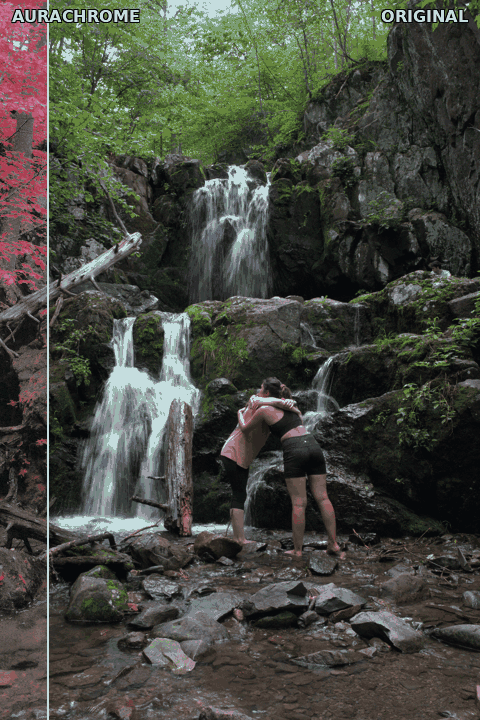
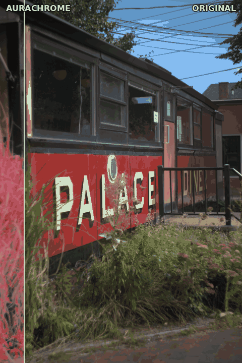

# Aurachrome — false-color film engine

<p align="center">
  
</p>

### Before / after

The bar sweeps across to reveal the conversion — foliage → infrared magenta and a
red → green sign:

<p align="center">
  
  
</p>

<sub>These auto-wipe rather than drag — GitHub READMEs can't run JavaScript, so a
true draggable slider would need a GitHub Pages docs site.</sub>

**Aurachrome** is a Python engine that renders the Kodak Aerochrome / EIR
color-infrared "false color" look from camera RAW to lossless 16-bit TIFF (CPU or
CUDA GPU), for a **Sony A7C II** stills workflow into Lightroom → Photoshop. It
also still emits a portable 3D `.cube` LUT and an experimental Lightroom profile
(both deprecated in favor of the RAW→TIFF engine).

Beyond the Aerochrome false-color look it also renders **redscale** (a parametric,
visible-light stock) and **Kodak HIE** (B&W infrared, Wood effect + halation) — see
[Looks](#looks-film-stocks).

This is a **perceptual approximation, not a physical one.** "Close, not perfect."

## Quick start

```bash
./aurachrome    # launch the TUI — the default run command
```

That's it. `./aurachrome` is the launcher: on first run it compiles the Go TUI
(and again whenever a `tui/*.go` changes), bootstraps the Python engine's
virtualenv if needed, then runs. Needs Go (to build the TUI) and Poetry (for the
engine); a one-time `make setup` installs those deps if you don't have them.

```bash
make setup      # one-time: install Poetry (if missing) + deps, build the TUI
make doctor     # verify python / poetry / go / GPU
make install    # optional: also put `aurachrome` on your PATH (~/.local/bin)

make convert ARGS="-i RAWS/ -o OUT/ --preset classic --gpu"   # headless batch
```

`make deps` auto-adds the CUDA group when an NVIDIA GPU is present (force with
`make gpu`, skip with `GPU=0`). Run `make help` for all targets. Manual
(Poetry/Go) details below.

## Install & run (Poetry)

Dependencies are managed with [Poetry](https://python-poetry.org/) in an isolated
virtualenv (keep this off your global/conda env):

```bash
poetry install                 # core CPU stack
poetry install --with gpu      # + CUDA acceleration (NVIDIA GPU; CUDA 12.x)
poetry install --with dev      # + pytest
poetry shell                   # activate the env (or prefix commands with `poetry run`)
```

The GPU group pulls CuPy plus the NVIDIA CUDA runtime wheels (incl. `libnvrtc`),
so **no system-wide CUDA toolkit is needed** — only an NVIDIA driver.

### The converter (primary workflow)

The fidelity-first pipeline is **shot RAW → converter → 16-bit TIFF → Lightroom →
Photoshop**. The converter applies the exact transform (no Lightroom-profile
approximation, no look-table banding) plus optional chromatic film grain, and
writes lossless 16-bit TIFFs (sRGB).

```bash
poetry run aurachrome                                            # interactive TUI
poetry run aurachrome -i RAWS/ -o OUT/ --preset classic          # batch
poetry run aurachrome -i RAWS/ -o OUT/ --preset all --gpu        # all looks, GPU
poetry run aurachrome -i RAWS/ -o OUT/ --format both --longedge 2048   # TIFF+JPEG, downscaled
poetry run aurachrome -i RAWS/ -o OUT/ --no-grain --no-neural --jobs 8 # CPU, GRVI, 8 workers
```

Export options:

- `--format tiff16|jpeg|both` — 16-bit TIFF (default), an 8-bit sRGB JPEG, or both
  written side by side. JPEG is the quick-share / proof; TIFF is the master.
- `--grain off|subtle|standard|heavy` — chromatic film-grain amount (default
  `standard`; `--no-grain` is an alias for `off`).
- `--longedge N` — downscale the long edge to `N` px (0 = full resolution) for
  fast previews.
- `--no-neural` — force the per-pixel GRVI index even when the learned NIR model
  is present (otherwise neural NIR is the default IR source on the serial path).

Why 16-bit TIFF and not "RAW out": a camera RAW is undemosaiced sensor data;
once the look is applied you have real RGB pixels, so there is no mosaic to write
back. 16-bit TIFF is the lossless, universal interchange for LR/PS.

### TUI (Go / Bubble Tea)

A terminal wizard front-end lives in `tui/` (its own Go module, Charm stack). It
collects input/output and the export options (look · format · size · grain · IR
engine · device · jobs), then drives the Python engine as a subprocess and renders
its JSON progress live — including which IR source actually ran (neural NIR vs
GRVI). The engine and TUI stay decoupled: the contract is the `--progress-json`
line stream.

```bash
./aurachrome      # from the repo root — builds the Go binary on first run, then launches
```

`./aurachrome` is a small launcher script: it compiles `tui/aurachrome` the first
time (and whenever a `tui/*.go` source changes), then execs it. No PATH install
needed — just `cd` into the repo and run it (needs Go to build, `poetry` + the
engine to run). `make install` is optional if you do want it on your PATH.

Overrides: `AURACHROME_ENGINE="poetry run aurachrome"` (the command) and
`AURACHROME_REPO=/path/to/repo` (working dir). Tests: `go test ./tui` (headless
state-machine smoke test; a live bridge test runs under `AURA_ENGINE_TEST=1`).

## GPU acceleration

The per-pixel transform is ~77% of the runtime and is pure elementwise math, so
it maps almost perfectly to a GPU. `aerochrome/backend.py` dispatches each array
to NumPy (CPU) or CuPy (CUDA) via `cupy.get_array_module` — **one codepath**, and
it silently stays on CPU if no GPU/CuPy is present.

- `--gpu` / `--cpu` force the backend; default auto-detects.
- `--jobs N` fans a CPU batch across worker processes (auto on multi-core).
- Measured (RTX 3090 Ti, full-res 33 MP, float64): transform+grain **35.2s → 3.2s
  (~11×)**; full 6-image batch (incl. RAW decode + TIFF write) ~27s.
- float64 is kept for fidelity; consumer cards run it slower than float32, so the
  win is real but smaller than float32 would give.

## The one constraint that defines the project

A normal A7C II has an IR-cut filter, so the files contain **no infrared
channel** — only visible RGB. The Aerochrome look is *driven* by near-IR
reflectance. So the output is a pure per-pixel function `(R,G,B) → (R,G,B)`.

Two surfaces with identical visible RGB (a live leaf vs. a green-painted wall)
**cannot** be separated — that's information theory, not a bug. We synthesize a
fake IR channel from a visible vegetation index and lean on the fact that, in
real scenes, "looks like a plant" correlates with "IR-bright." Everything here
is bakeable per-pixel; no spatial ops (those would break the pure-LUT
requirement).

## How it works (the color science)

Real color-infrared film does a **channel rotation**, blue discarded by a yellow
filter:

```
RED_out   <- INFRARED   (IR-bright live vegetation -> red)
GREEN_out <- RED        (red objects -> green)
BLUE_out  <- GREEN      (green objects -> blue)
```

We have RGB but no IR, so IR is the only *synthesized* term — built from `GRVI =
(G-R)/(G+R)`, gated by `GBI = (G-B)/(G+B)` to reject blue/cyan sky.

This implementation is **re-architected** off the reference baseline for color
correctness:

- The mechanical rotation and foliage/sky shaping run in **linear light**.
- The corrective grade (skin / neutral / highlight) runs in **OKLab/OKLCh**,
  where "warm low-chroma skin" and "near-neutral concrete" are clean, separable
  windows (a hue arc + a chroma threshold) instead of overlapping sRGB ratio
  hacks. This is what fixed the original baseline's *skin-too-emerald* and
  *neutrals-drift-teal* problems at the root.

See `aerochrome/transform.py` for the annotated pipeline.

## Layout

```
aerochrome/
  transform.py   the core Aerochrome (R,G,B)->(R,G,B) false-color function
  stocks.py      StockProfile registry dispatching the film families
  redscale.py    redscale stock (parametric, visible-only, no neural)
  monoir.py      HIE / mono-IR stock (B&W infrared, Wood effect)
  halation.py    HIE/Efke halation-bloom spatial pass (export-only)
  grain.py       chromatic film grain (spatial, export-only)
  params.py      look presets (classic/punchy/muted/portrait) + stock params
  encodings.py   sRGB<->linear, OKLab/OKLCh, S-Log3/S-Gamut3.Cine
  spectral.py    render RGB + an IR band from reflectance spectra
  neural/        learned RGB->NIR U-Net (the default IR source)
  backend.py     NumPy/CuPy dispatch (one CPU/GPU codepath)
  cube.py        write/read .cube (17/33/65) + trilinear apply (legacy)
scripts/
  aero_convert.py          the converter + TUI entry (console: aurachrome)
  ingest_hyperspectral.py  ENVI hyperspectral cube -> (RGB, NIR-band) pairs
  synth_spectra.py         synthesize paired data (PROSPECT + skin models)
  train_nir.py             train / finetune the RGB->NIR model
  make_cube.py / apply_lut.py / make_profile.py   legacy .cube/.dcp export
tests/           stocks, monoir, halation, ingest, synth, swatches
tui/             Go / Bubble Tea wizard front-end
luts/            generated .cube + preview/ PNGs (legacy)
```

## Quickstart

```bash
pip install numpy pillow tifffile   # only deps (tifffile = true 16-bit TIFF)

python scripts/make_cube.py                  # -> luts/Aerochrome_Classic_Display_{33,65}.cube
python scripts/preview.py                     # -> luts/preview/swatches.png, scene.png
python scripts/apply_lut.py my.tif out.tif    # apply default 65pt LUT to one photo
python scripts/apply_lut.py --indir in/ --outdir out/   # batch a whole folder
python tests/test_swatches.py                 # regression check

# presets / sizes / tuning
python scripts/make_cube.py --preset punchy --size 33
python scripts/tune.py --param ir_veg --values 1.1,1.55,1.9 \
                       --param2 foliage_green_cut --values2 0.25,0.35,0.45
```

`apply_lut.py --direct` runs the transform without the LUT (full precision),
useful for confirming a `.cube` matches its source.

## Looks (film stocks)

Three families, selected with `--preset`:

| preset     | family        | character                                                  |
|------------|---------------|------------------------------------------------------------|
| `classic`  | Aerochrome    | balanced false-color IR, the default                       |
| `punchy`   | Aerochrome    | max foliage pop, low desat, high contrast                  |
| `muted`    | Aerochrome    | lower saturation, closer to faded EIR scans                |
| `portrait` | Aerochrome    | classic everywhere except skin, kept near-natural          |
| `redscale` | visible       | colour-neg-through-the-base, warm red→yellow (no IR/neural)|
| `hie`      | mono-IR (B&W) | Kodak HIE: B&W infrared, Wood effect + halation glow        |

`--preset all` renders the four Aerochrome looks. The Aerochrome and HIE families
use the neural NIR (GRVI fallback); redscale is purely parametric. Stock profiles
live in `aerochrome/stocks.py`.

## Encoding variants

- **Display (primary).** Input is sRGB / Rec.709 display-referred — a normal
  developed still. Use for Lightroom / Photoshop / Capture One / Resolve on
  stills. These are the `Aerochrome_*_Display_*.cube` files.
- **S-Log3 (secondary, in-camera / Log video).** Decode S-Log3 → linear, run the
  transform, re-encode. Curves live in `encodings.py`; a dedicated S-Log3
  make-target is the next build step (display is shipped first).

## Loading per target app

**Sony A7C II (in-camera, Log/video).** Copy the 8.3-named `AEROCHR.cube` to the
card, then `MENU → Exposure/Color → Color/Tone → Manage User LUTs →
Import/Edit → User1–User16`. Applies in the Log shooting pipeline and previews
live in the EVF. **Stills note:** this is a Log/movie feature — for stills, apply
the LUT in post instead (below). *(Use the Display variant for stills; an S-Log3
variant for the in-camera Log path is the next build step.)*

**Lightroom Classic (stills — the primary workflow).** A `.cube` is a LUT, not a
develop preset, and LR can't load one directly. There is also **no in-camera path
for stills** on the A7C II (its User LUT is movie-only; Creative Look can't do the
channel rotation; RAW carries no baked look). So the look is applied on the way out
of Lightroom, exactly and automatically, via an **Export post-process**:

1. In LR, develop/cull normally. Export to a folder as **16-bit TIFF, sRGB**
   (or 8-bit JPEG). Bit depth is preserved for TIFF.
2. Run the cube over that folder:
   ```bash
   python scripts/apply_lut.py --indir /path/to/export --outdir /path/to/aerochrome
   ```
   Each file gets an `_aerochrome` copy with the look baked in, display-correct
   (identical to the Photoshop/Resolve result).
3. (Optional, fully hands-off) Put a one-line wrapper that calls step 2 into
   Lightroom's **Export Actions** folder so LR runs it automatically after every
   export.

**Lightroom profile (`.dcp`) — one-click in the Profile Browser.** For a native
preset experience, `scripts/make_profile.py` bakes the look into a Lightroom camera
profile:

```bash
python scripts/make_profile.py                    # -> luts/Aerochrome_Classic.dcp
```

Install it (Windows) into:
`C:\Users\<you>\AppData\Roaming\Adobe\CameraRaw\CameraProfiles\`
(macOS: `~/Library/Application Support/Adobe/CameraRaw/CameraProfiles/`), restart
Lightroom, then **Develop → Profile Browser → Aerochrome**. Save it into a develop
preset (Profile + any tweaks) for true one-click. Attaches to `ILCE-7CM2` by default
(`--model` to change).

Honest caveat: a profile applies its look mid-pipeline in LR's reference space (not
display space), and embeds a representative — not exact — Sony color matrix, so it
*approximates* the `.cube` rather than matching the export result byte-for-byte. For
a stylized false-color look that's fine; use the Export route above when you want the
exact cube. The look-table resolution / color matrix are easy to refine once eyeballed.

**Photoshop (exact, per-photo).** Layer → New Adjustment Layer → **Color Lookup** →
Load 3D LUT. Good for one-off hero edits; batchable via a PS action.

**Capture One.** Add as a LUT layer / ICC-style adjustment.

**DaVinci Resolve.** Drop the `.cube` into the LUT folder → apply as a node LUT.
Resolve is also the reference for verifying channel ordering: this writer uses
the standard **red-fastest** ordering (`idx = r + g·N + b·N²`); grid points round-
trip exactly through `cube.apply_trilinear`.

## Validation status (handoff §6 / §7)

All §6 surfaces land in their expected hue family, and the three §7 problems are
fixed vs. the baseline:

| surface          | baseline   | this build | status              |
|------------------|------------|------------|---------------------|
| caucasian skin   | emerald    | `#cabd96`  | pale yellow-green ✅ |
| concrete         | teal       | `#7e8280`  | near-neutral ✅      |
| asphalt          | teal       | `#3b3934`  | dark neutral ✅      |

Regression-locked in `tests/test_swatches.py`.

## Known limits / next steps

- **Leaf vs. paint** is unsolvable per-pixel (see constraint above). The chroma-
  aware veg term improves *separation* of organic vs. dull greens but cannot
  recover real IR.
- **S-Log3 make-target** for the in-camera Log path (encodings are ready).
- **ΔE2000 auto-tune** against a real Aerochrome scan + matched visible shot
  (handoff §9 stretch).
- **Spatial pass** (texture/edge cue for foliage) would help leaf-vs-paint but
  *breaks the pure-LUT requirement* — if built, ships as `apply_lut.py --spatial`
  for stills only, not exportable to the camera.

## References & further reading

Aurachrome's design rests on a few well-studied ideas: color-infrared film does a
fixed band rotation; live vegetation is bright in the near-infrared for physical
reasons; that NIR signal *correlates* with — but is not recoverable from —
visible-band vegetation indices; and the corrective grade is best done in a
perceptually uniform color space. The literature below grounds each of those
choices (and honestly bounds what synthesizing a missing IR channel can achieve).
Citations were verified against publisher records, DOI resolvers, arXiv, and
official documents; where a conference page range was only available from a
secondary index it reflects the widely-cited value.

### Color-infrared film & the false-color look

- Eastman Kodak Company (2003). *KODAK PROFESSIONAL EKTACHROME Infrared EIR Film* (Technical Data, Pub. TI2323). [PDF](https://www.chrysis.net/wp-content/uploads/2020/09/Kodak-EKTACHROME-INFRARED.pdf) — Manufacturer datasheet documenting the green/red/IR-sensitive layers, the mandatory Wratten 12 yellow filter, and the false-color reversal mechanism Aurachrome emulates.
- U.S. Geological Survey. *What do the different colors in a color-infrared aerial photograph represent?* [USGS FAQ](https://www.usgs.gov/faqs/what-do-different-colors-a-color-infrared-aerial-photograph-represent) — Authoritative interpretation of CIR false color (vegetation → red, water → dark blue/black), validating the target color assignments.
- Lillesand, T. M., Kiefer, R. W. & Chipman, J. W. (2015). *Remote Sensing and Image Interpretation*, 7th ed. Wiley. ISBN 978-1-118-34328-9 — Canonical text describing CIR film construction and the IR→red, red→green, green→blue band shift that defines the false-color composite.

### Why vegetation is infrared-bright (plant optics)

- Wood, R. W. (1910). "Photography by Invisible Rays." *The Photographic Journal* (Royal Photographic Society), vol. 50 — First IR landscape photographs and the origin of the "Wood effect" (foliage glowing in IR), the optical phenomenon the synthetic-IR channel reproduces.
- Gates, D. M., Keegan, H. J., Schleter, J. C. & Weidner, V. R. (1965). "Spectral Properties of Plants." *Applied Optics* 4(1):11–20. [doi:10.1364/AO.4.000011](https://doi.org/10.1364/AO.4.000011) — Foundational leaf reflectance/transmittance/absorptance measurements across UV–visible–IR.
- Knipling, E. B. (1970). "Physical and physiological basis for the reflectance of visible and near-infrared radiation from vegetation." *Remote Sensing of Environment* 1(3):155–159. [doi:10.1016/0034-4257(70)80021-9](https://doi.org/10.1016/0034-4257(70)80021-9) — Seminal explanation of low visible (chlorophyll absorption) and high NIR (mesophyll scattering) leaf reflectance.
- Gausman, H. W. & Allen, W. A. (1973). "Optical Parameters of Leaves of 30 Plant Species." *Plant Physiology* 52(1):57–62. [Oxford Academic](https://academic.oup.com/plphys/article/52/1/57/6073790) — Quantifies how mesophyll cell/air-space structure governs the NIR reflectance plateau (~850 nm).
- Horler, D. N. H., Dockray, M. & Barber, J. (1983). "The red edge of plant leaf reflectance." *Int. J. Remote Sensing* 4(2):273–288. [doi:10.1080/01431168308948546](https://doi.org/10.1080/01431168308948546) — Characterizes the "red edge" (sharp 680–750 nm rise), the spectral feature the vegetation gate keys on.

### Vegetation indices from visible / RGB bands

- Rouse, J. W., Haas, R. H., Schell, J. A. & Deering, D. W. (1974). "Monitoring Vegetation Systems in the Great Plains with ERTS." *Third ERTS-1 Symposium*, NASA SP-351, 1:309–317. [NTRS](https://ntrs.nasa.gov/citations/19740022614) — Origin of NDVI; the red/NIR contrast Aurachrome must approximate without a true IR band.
- Tucker, C. J. (1979). "Red and Photographic Infrared Linear Combinations for Monitoring Vegetation." *Remote Sensing of Environment* 8(2):127–150. [doi:10.1016/0034-4257(79)90013-0](https://doi.org/10.1016/0034-4257(79)90013-0) — Why red+NIR combinations outperform green+red, framing the information lost by working from visible bands only.
- Woebbecke, D. M., Meyer, G. E., Von Bargen, K. & Mortensen, D. A. (1995). "Color Indices for Weed Identification Under Various Soil, Residue, and Lighting Conditions." *Transactions of the ASAE* 38(1):259–269. [doi:10.13031/2013.27838](https://doi.org/10.13031/2013.27838) — Introduces Excess Green (2g−r−b), showing RGB chromatic coordinates can segment vegetation.
- Gitelson, A. A., Kaufman, Y. J., Stark, R. & Rundquist, D. (2002). "Novel Algorithms for Remote Estimation of Vegetation Fraction." *Remote Sensing of Environment* 80(1):76–87. [doi:10.1016/S0034-4257(01)00289-9](https://doi.org/10.1016/S0034-4257(01)00289-9) — Defines VARI = (G−R)/(G+R−B), whose green/blue structure mirrors Aurachrome's green-vs-blue-gated GRVI.
- Motohka, T., Nasahara, K. N., Oguma, H. & Tsuchida, S. (2010). "Applicability of Green-Red Vegetation Index for Remote Sensing of Vegetation Phenology." *Remote Sensing* 2(10):2369–2387. [doi:10.3390/rs2102369](https://doi.org/10.3390/rs2102369) — The foundational GRVI = (G−R)/(G+R) paper Aurachrome relies on for visible-only vegetation detection.
- Hunt, E. R. Jr., Doraiswamy, P. C., McMurtrey, J. E., Daughtry, C. S. T., Perry, E. M. & Akhmedov, B. (2013). "A visible band index for remote sensing leaf chlorophyll content at the canopy scale." *Int. J. Applied Earth Observation and Geoinformation* 21:103–112. [doi:10.1016/j.jag.2012.07.020](https://doi.org/10.1016/j.jag.2012.07.020) — The Triangular Greenness Index (TGI); physiologically meaningful signal recoverable from R/G/B alone.

### Estimating infrared from visible (the synthesis problem & its limits)

- Costa, L., Nunes, L. & Ampatzidis, Y. (2020). "A new visible band index (vNDVI) for estimating NDVI values on RGB images utilizing genetic algorithms." *Computers and Electronics in Agriculture* 172:105334. [doi:10.1016/j.compag.2020.105334](https://doi.org/10.1016/j.compag.2020.105334) — Estimates NDVI directly from RGB, exemplifying both feasibility and the inherent approximation error a synthetic IR channel inherits.
- Aslahishahri, M. et al. (2021). "From RGB to NIR: Predicting Near Infrared Reflectance From Visible Spectrum Aerial Images of Crops." *ICCV Workshops (CVPPA)*, 1312–1322. [CVF Open Access](https://openaccess.thecvf.com/content/ICCV2021W/CVPPA/html/Aslahishahri_From_RGB_to_NIR_Predicting_of_Near_Infrared_Reflectance_From_ICCVW_2021_paper.html) — The closest published analogue to Aurachrome's core idea — learning a missing IR channel from RGB — and a documentation of its accuracy limits.
- Davidson, C. et al. (2022). "NDVI/NDRE prediction from standard RGB aerial imagery using deep learning." *Computers and Electronics in Agriculture* 203:107396. [doi:10.1016/j.compag.2022.107396](https://doi.org/10.1016/j.compag.2022.107396) — Reinforces that visible-to-IR inference is approximate and bounded by the information actually present in RGB.

### Near-infrared ↔ visible translation, colorization & spectral reconstruction

- **Fredembach, C. & Süsstrunk, S. (2008). "Colouring the Near-Infrared." *Proc. IS&T/SID 16th Color and Imaging Conference (CIC)*, 176–182. [doi:10.2352/CIC.2008.16.1.art00034](https://doi.org/10.2352/CIC.2008.16.1.art00034)** — Foundational EPFL/IVRL work on mapping NIR scene content into visible color; directly informs the IR→visible false-color mapping.
- Schaul, L., Fredembach, C. & Süsstrunk, S. (2009). "Color Image Dehazing Using the Near-Infrared." *IEEE ICIP*, 1629–1632. [EPFL Infoscience](https://infoscience.epfl.ch/entities/publication/782e09a8-4ad8-4c93-adff-2d23ceb12128) — NIR+visible fusion to recover haze-free color; a model for exploiting IR's atmospheric penetration.
- Brown, M. & Süsstrunk, S. (2011). "Multispectral SIFT for Scene Category Recognition." *IEEE CVPR*, 177–184. [EPFL RGB-NIR dataset](https://www.epfl.ch/labs/ivrl/research/downloads/rgb-nir-scene-dataset/) — Introduces the standard paired visible/NIR benchmark for training/evaluating IR↔visible translation.
- Nguyen, R. M. H., Prasad, D. K. & Brown, M. S. (2014). "Training-Based Spectral Reconstruction from a Single RGB Image." *ECCV*, LNCS 8695:186–201. [doi:10.1007/978-3-319-10584-0_13](https://doi.org/10.1007/978-3-319-10584-0_13) — Recovers per-pixel spectral reflectance from RGB given a known camera response; the inverse-problem basis for inferring IR behavior from visible files.
- Arad, B. & Ben-Shahar, O. (2016). "Sparse Recovery of Hyperspectral Signal from Natural RGB Images." *ECCV*, LNCS 9911:19–34. [doi:10.1007/978-3-319-46478-7_2](https://doi.org/10.1007/978-3-319-46478-7_2) — Sparse-dictionary reconstruction of full spectra (incl. near-IR) from ordinary RGB.
- Limmer, M. & Lensch, H. P. A. (2016). "Infrared Colorization Using Deep Convolutional Neural Networks." *IEEE ICMLA*. [arXiv:1604.02245](https://arxiv.org/abs/1604.02245) — Multi-scale CNN transferring RGB color onto NIR while preserving IR detail; a deep-learning analogue of the IR→visible synthesis problem.
- Sun, T., Jung, C., Fu, Q. & Han, Q. (2019). "NIR to RGB Domain Translation Using Asymmetric Cycle Generative Adversarial Networks." *IEEE Access* 7:112459–112469. [doi:10.1109/ACCESS.2019.2933671](https://doi.org/10.1109/ACCESS.2019.2933671) — Asymmetric CycleGAN handling the information gap between 1-channel NIR and 3-channel RGB.
- Zhai, H., Chen, M., Yang, X. & Kang, G. (2024). "Multi-scale HSV Color Feature Embedding for High-fidelity NIR-to-RGB Spectrum Translation." [arXiv:2404.16685](https://arxiv.org/abs/2404.16685) — Recent state of the art decomposing NIR→RGB into texture, geometry, and color sub-tasks.
- Borstelmann, A., Haucke, T. & Steinhage, V. (2024). "The Potential of Diffusion-Based Near-Infrared Image Colorization." *Sensors* 24(5):1565. [doi:10.3390/s24051565](https://doi.org/10.3390/s24051565) — Diffusion-model NIR colorization; a modern generative counterpart to the IR-to-color problem.

### Color science: perceptual spaces, appearance & spectral → display

- Ottosson, B. (2020). *A perceptual color space for image processing (Oklab)*. [bottosson.github.io](https://bottosson.github.io/posts/oklab/) — The canonical derivation of OKLab/OKLCh, the perceptual space used for the corrective skin/neutral/highlight grade.
- Ebner, F. & Fairchild, M. D. (1998). "Development and testing of a color space (IPT) with improved hue uniformity." *Proc. IS&T/SID 6th Color Imaging Conference*, 8–13. [IS&T](https://library.imaging.org/cic/articles/6/1/art00003) — The LMS-based opponent space whose structure OKLab adapts.
- Sharma, G., Wu, W. & Dalal, E. N. (2005). "The CIEDE2000 color-difference formula: implementation notes, supplementary test data, and mathematical observations." *Color Research & Application* 30(1):21–30. [doi:10.1002/col.20070](https://doi.org/10.1002/col.20070) — Correctly-implementable ΔE2000 for measuring perceptual color differences when validating the grade.
- Moroney, N. et al. (2002). "The CIECAM02 Color Appearance Model." *Proc. IS&T/SID 10th Color Imaging Conference*, 23–27. [PDF](http://markfairchild.org/PDFs/PRO19.pdf) — Standard color appearance model whose adaptation/response-compression concepts underpin perceptual grading.
- Fairchild, M. D. (2013). *Color Appearance Models*, 3rd ed. Wiley–IS&T. [doi:10.1002/9781118653128](https://doi.org/10.1002/9781118653128) — The definitive reference on color appearance and adaptation.
- IEC (1999). *IEC 61966-2-1:1999 — Default RGB colour space — sRGB*. [IEC Webstore](https://webstore.iec.ch/en/publication/6169) — Defines sRGB primaries and the linear↔sRGB transfer function used for display-RGB output.
- Wyszecki, G. & Stiles, W. S. (1982). *Color Science: Concepts and Methods, Quantitative Data and Formulae*, 2nd ed. Wiley. ISBN 978-0-471-02106-3 — Canonical colorimetry reference for color matching, spectral-to-tristimulus integration, metamerism, and chromatic adaptation.
- Hunt, R. W. G. (2004). *The Reproduction of Colour*, 6th ed. Wiley–IS&T. [doi:10.1002/0470024275](https://doi.org/10.1002/0470024275) — Color reproduction, white balance, and film/imaging response relevant to emulating the Aerochrome look from sensor responses.
- Finlayson, G. D. & Süsstrunk, S. (2000). "Spectral sharpening and the Bradford transform." *Proc. Color Imaging Symposium (CIS)*, 236–242. [PDF](http://www2.cmp.uea.ac.uk/Research/compvis/Papers/FinSuss_COL00.pdf) — von Kries / Bradford chromatic-adaptation transforms for white balance and illuminant adaptation.
